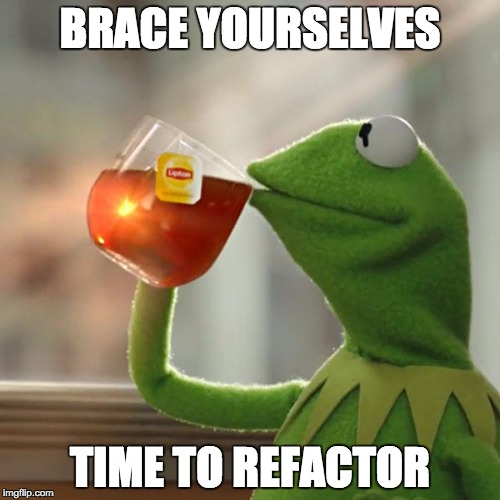

---

title   : Reactive P2P Chat
author  :
  name    : Tadeusz Łazurski
  twitter : @lazurski
  github  : lzrski

---

### Set up new project

```bash
mkdir p2p-chat
cd p2p-chat
git init
npm init
```

Just press enter for every question.

---

# .gitignore

Make sure build artifacts won't clutter your source control. Put this in your `.gitignore` file:

```
node_modules/
build/
npm-debug.log
*.sublime-workspace
.DS_Store
```

---

### Install development dependencies...

```bash
npm install --save-dev \
  browserify \
  watchify \
  babelify \
  babel-preset-react \
  babel-preset-es2015
```

...and commit changes

```
git add --all .
git commit -m 'Install development dependencies'
```

> PRO TIP: commit on each step

---

### Bootstrap some code

Make some new files:

`index.html`

```html
<!DOCTYPE html>
<html>
  <head>
    <meta charset="utf-8">
    <title>Let's Chat!</title>
  </head>
  <body>
    <script src="build/application.js"></script>
  </body>
</html>
```

`src/index.js`

```javascript
console.log("Hello, there. Let's chat!")
```

---

### Transform and bundle our file

```bash
mkdir -p build
./node_modules/.bin/browserify \
  -t [ babelify --presets [ es2015 react ] ] \
  -o build/application.js \
  src/index.js
```

You should have a file called `build/application.js` with weird looking code. It's a bundle. Not that we reference it in our html file.

---

### Open the html file

```bash
xdg-open index.html # Linux
open index.html     # OSX
```

Then, in the browser, open the console (`alt-ctrl-j` / `alt-cmd-j`).

You should see:

```
Hello, there. Let's chat!
```

> FRIENDLY REMINDER: Commit!

---

Let's avoid typing this terrible thing by using NPM scripts. In `package.json` find scripts section and add a new script called `build`:

```json
"scripts": {
  "test": "echo \"Error: no test specified\" && exit 1",
  "build": "mkdir -p build; browserify -t [ babelify --presets [ es2015 react ] ] -o build/application.js src/index.js"
},
```

Now you can execute more friendly command:

```bash
npm run build
```

---

Avoid manual recompilation every time we save a file by adding `develop` script with `watchify` command and `--debug` option for source maps:

```json
"scripts": {
  "test": "echo \"Error: no test specified\" && exit 1",
  "build": "mkdir -p build; browserify -t [ babelify --presets [ es2015 react ] ] -o build/application.js src/index.js",
  "develop": "mkdir -p build; watchify -t [ babelify --presets [ es2015 react ] ] -o build/application.js --debug src/index.js"
},
```

Now run

```bash
npm run develop
```

---

### Enter Simple Peer

Let's play with some P2P connectivity. We will use [feross/simple-peer][] for that:

```bash
npm install --save simple-peer
```

[feross/simple-peer]: https://github.com/feross/simple-peer

---

### In process communication

We start with two peers running in same webpage. It's not very useful on it's own, but it's a good starting point.

```javascript
import Peer from simple-peer

const p1 = Peer({trickle: false, initiator: true})
const p2 = Peer({trickle: false})
```

---

### Make some noise

To have some insight in the operations of peers, let's make them output logs whenever something of interest happens. They are `event-emitters`, so we need to hook into their events.

```javascript
p1.on('singal', (data) => console.log('p1 signal', data))
p1.on('connect', () => console.log('p1 connected'))
p1.on('data', (data) => console.log('p1 received', data))
p1.on('error', (error) => console.error('p1 error', error))
p1.on('close', () => console.log('p1 connection closed'))

// Same for p2...
```

And reload your browser.

---

### Let's connect

In order to connect, peers need to exchange so called signaling data. Internally they use it to find each other.

The initiator peer will emit signal immediately after it's created. You should see it in the console. It's this weird looking thing:

```
{"type":"offer","sdp":"v=0\r\no=- 1363672724809654390 2 IN IP4 127.0.0.1\r\ns=-\r\nt=0 0\r\na=msid-semantic: WMS\r\nm=application 9 DTLS/SCTP 5000\r\nc=IN IP4 0.0.0.0\r\na=ice-ufrag:zeBNQizxw4zejNZa\r\na=ice-pwd:fyTyIOTAhitF1MJxxCrOMti3\r\na=fingerprint:sha-256 A2:38:96:A2:E0:F9:04:72:E1:E4:62:54:66:79:7D:B0:CC:4A:24:9A:29:A0:97:8D:FA:9C:E7:B5:52:DD:14:0B\r\na=setup:actpass\r\na=mid:data\r\na=sctpmap:5000 webrtc-datachannel 1024\r\n"}
```

Don't worry - we don't need to comprehend the meaning of this.

---

Instead we need to pass this signal to the other peer. Let's change the `signal` handler function of `p1`:

```javascript
p1.on('singal', (data) => {
  console.log('p1 signal', data))
  p2.signal(data)
}
```

Now in the console we should see, that the `p2` is also emitting a signal. Note, that it is not the same thing we passed. In particular the `type` field is `answer` instead of `offer`.

---

This signal from `p2` needs to be passed to `p1` in turn.

```javascript
p2.on('singal', (data) => {
  console.log('p2 signal', data))
  p1.signal(data)
}
```

At some point the connection will be established and `connect` event triggered.

---

Once we have a connection, let's send something. It can be anything, so let's start with a simple number:

```javascript
p1.on('connect', () => {
  console.log('p1 connected'))
  p1.send(42)
}

```

And let p2 respond with a bigger number:

```javascript
p1.on('data', (data) => {
  console.log('p1 received', data)
  p2.send(data+1)
})
```

Do you see the numbers in the console? If so then commit.

---

### Time for React

Before we separate the pears we should add some UI. We will use `facebook/react` for this. It separated in two modules:

```bash
npm install --save react react-dom
```

---

### React and the DOM

In browsers, there is an API called DOM: Document Object Model. What you see on your screen when you visit a web page is a `document`, and the DOM API gives you access to it.

---

The DOM API is rather terrible - interacting with it is slow and cumbersome.  However if you want browser to display anything it's the only way other then giving your browser entire new HTML *file*.

Same for processing user interactions - like clicking a button or filling a form. Without using DOM API you can only send it to the server, process it there and send back new HTML.

That is called `full page refresh` and until recently it was the only way of building web apps.

---

### Virtual DOM

In react we very seldom use DOM API directly. In most applications it's only when you call `render` function from `react-dom` module.

Other then that we use a different API called Virtual DOM. It's similar, but smarter.

---

### Elements

Just as DOM, Virtual DOM deals mainly of `elements`.

Each element has a type, like `div`, `a`, `p` etc. It also has a thing called `props` (which can affect the behavior of an element just like attributes you define in HTML). It can also have children - text or other elements.

---

We create an element by calling a `createElement` function from `react` module:

```javascript
import React, { createElement } from react

const link = createElement(
  'a', // type
  {
    href: 'https://facebook.github.io/react/',
    title: 'Read the docs'
  }, // props
  'Hello, React!' // Children
)
```

---

And render it using `render` function from `react-dom` module.

```javascript
const container = document.getElementById('app-container')
render(
  link,     // The element
  container // Where to render it - see next slide
)
```

---

We also need a place in the document where the element is to be rendered. In `index.html` add an container for it:

```html
<body>

<div id='app-container'><!-- The app goes here --></div>

<script src="build/application.js"></script>
</body>
```

---

Now refresh a browser and you should see a link we have created in previous slide.

Commit and rejoice :)

---

We will build our app UI as a tree of elements. Let's add two more:


```javascript
const link = createElement(
  'a', // type
  {
    href: 'https://facebook.github.io/react/',
    title: 'Read the docs'
  }, // props
  'Hello, React!' // Children
)
const heading = createElement('h1', {}, "It's all just elements")
const root = createElement('div', {}, heading, link)
render(
  root,     // Look out! It have changed.
  container
)
```

---

It should be familiar, because that's how you build a document using HTML. In fact, there is a thing called `JSX` that gives you a syntax for writing elements that is very similar to `HTML`. We will use it:

```html
const root = (
  <div>
    <h1>It's all elements</h1>
    <a
      title = 'Read the docs'
      href = 'https://facebook.github.io/react/'
    >
      Hello, React!
    </a>
  </div>
)
render(root, container)
```

---

### Being reactive

Remember our peers? The `p1` and `p2` guys?

Let's make our UI react to the changes in the state of `p1` peer.

> TODO:
> * React UI for connecting peers
> * Inter-browser communication

---

### Components

We can create our own element types:

```javascript
const App = () => createElement 'div', {}, 'Hello.'
```

---

There are two types of components:

* stateless:

  ```javascript
  MyComponent = (props) => //
  ```

* stateful (not covered today)
---


### Discover a bug!

Event handlers attached twice.

---

### Fix the bug



> TODO: Fix the bug: keep the state in check
> Multiple steps

---

### Enable ICE Tricles

Now there are multiple signal events emitted: one for offer / answer and several describing possible strategies for NAT traversals (candidates).

To establish connection all of those need to be exchanged between peers in correct order and within limited time (~30 s).

Try that :)

> TODO:
> Make signal property of the state an array
> On signal event push signaling data to the array
> Make connect function accept an array and call `peer.signal` once for every item.

Try that by hand - still quite difficult.

That's why in so called real life we would use some kind of signaling server - a simple tool to exchange the signals.

> TODO:
> * Multiple peers?
> * Game?
